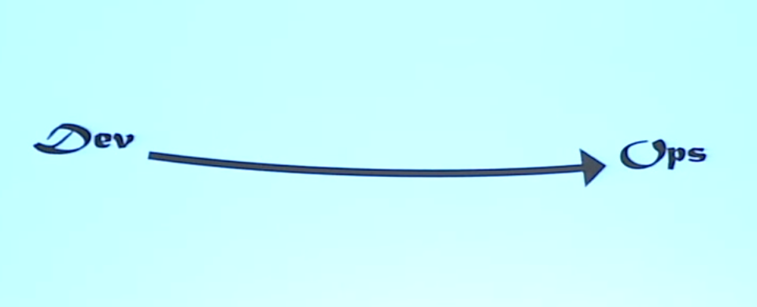
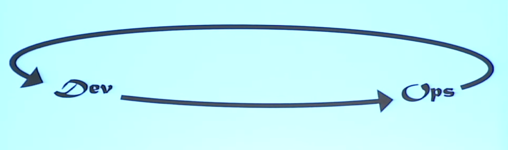
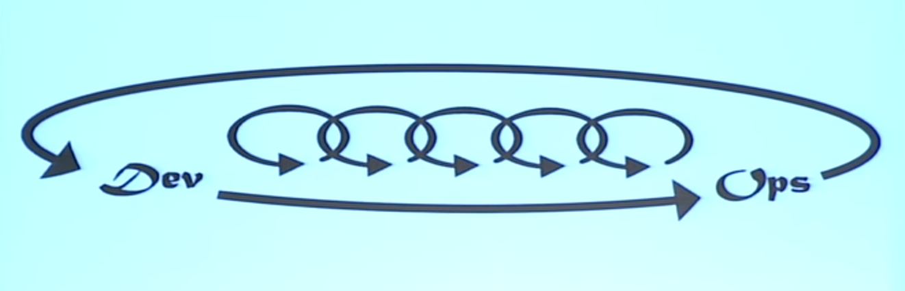
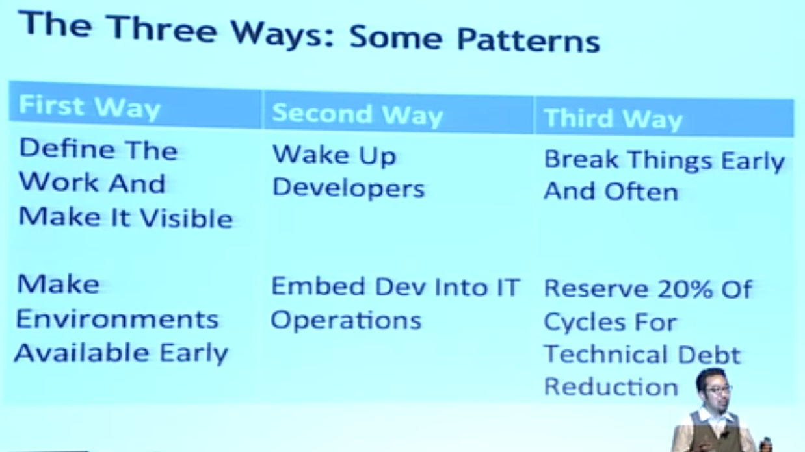

# Why We Need DevOps - Gene Kim
[链接](https://www.youtube.com/watch?v=877OCQA_xzE)

*Author of DevOps cookbook*
## Three ways
---
### The first way: Systems Thinking
  
- Understand the flow of work
- Always seek to increase flow
- Never unconsciously pass defects downstream
- Never allow local optimization to cause global degradation
- Achieve profound understanding of the system  

#### Practice #1: Define The Work and Make It Visible
- Business projects
- Internal IT projects
- Changes
- Unplanned work

#### Practice #2: Create One Step Environment Creation Process
- Make environments available early in Development process
- Make sure Dev builds the code and environment at the same time
- Create a common Dev, QA and Production environment creation process

**At the end of each sprint, we must have working code and the environment it runs in.**  

#### The First Way: Outcomes:
- Creating single repository for code and environment
- Determinism in the release process
- Consistent Dev, QA, Int, and Staging environments, all properly build before deployment begins
- Decreased cycle time
  - Reduce deployment times from 6 hours to 45 minutes
  - Refactor deployment process that had 1300+ steps spanning 4 weeks
- Faster release cadence

### The Second Way: Amplify Feedback Loops

- Understand and respond to the needs of all customers, internal and external
- Shorten and amplify all feedback loops: stop the line when necessary
- Create quality at the source
- Create and embed knowledge where we need it

*"We found that when we woke up developers at 2am, defects got fixed faster than ever" - Patrick*

#### Embed Dev Into IT Ops:
- Embed Dev into IT Ops incident escalation process
- Invite Dev to post-mortems/root cause analysis meeting
- Have Dev and infosec cross-train IT Operations
- Ensure application monitoring/metrics to aid in Ops and Infosec work(e.g, incident/problem management)

#### The Second Way: Outcomes:
- Defects and security issues getting fixed faster than ever
- Reusable Ops and Infosec user stories now part of Angile process
- All groups communicating and coordinating better
- Everybody is getting more work done

### The Third Way: Culture Of Continual Experimentation And Learning

- Foster a culture that rewards:
  - Experimentation(taking risks) and learning from failure
  - Repetition is the prerequisite to mastery
- Why?
  - You need a culture that keeps pushing into the danger zone
  - And have the habits that enable you to survive in the danger zone

#### Break Things Early And Often
*Do painful things more frequently, so you can make it less painful... We don't get pushback from Dev, because they know it makes rollouts smoother. -- Adrian*

#### Parttern #5: Inject Failures Often

#### Parttern #6: Break Things Before Production

- Enforce consistency in code, environments and configurations across the environments.
- Add your ASSERTs to find miscofigurations, enforce https, etc.
- Add static code analysis to automated continuous integration and testing process.

**Allocate 20% Of Cycle To Technical Debt Reduction**

### The Three Ways: Some Patterns

[slides](http://www.instantcustomer.com/go/74730)
