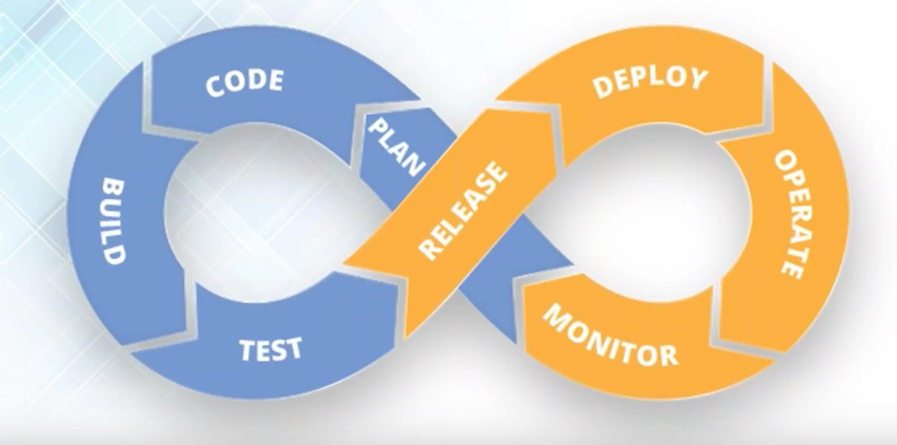
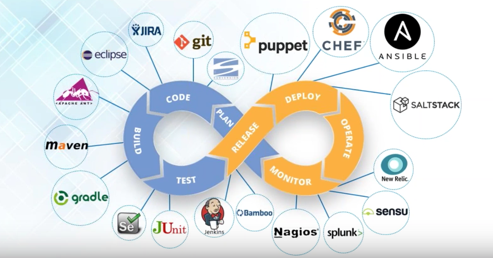
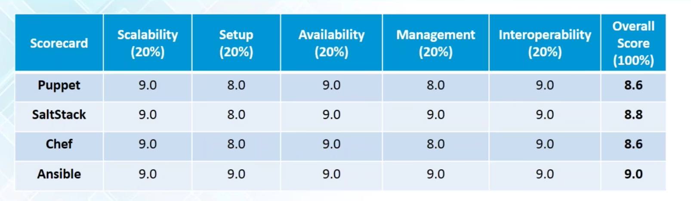

# Chef vs Puppet vs Ansible vs SaltStack
[链接](https://www.youtube.com/watch?v=OmRxKQHtDbY)

### What is DevOps Lifecycle

### Which are the tools used in DevOps Lifecycle

### Which tools are used for Configuration Management(CM) and Deployment? And Why?

Scenario:
- Mass Deployment
- Migrating from Test to Production: environment difference
- Application Failure: 3.am call

Why CM?
- shell script from scratch;
- workflow
- UI available  

### Chef | Puppet | Ansible | SaltStack - On What factors to compare?

**IMPORTANT: Infrastructure as Code**

