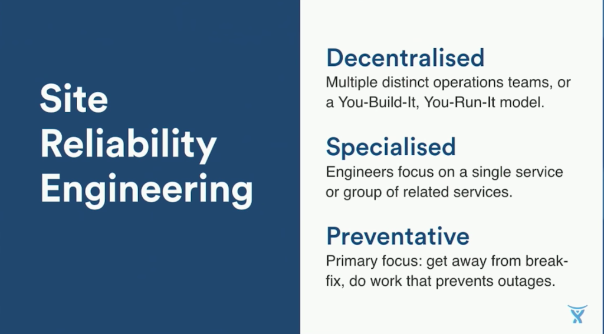
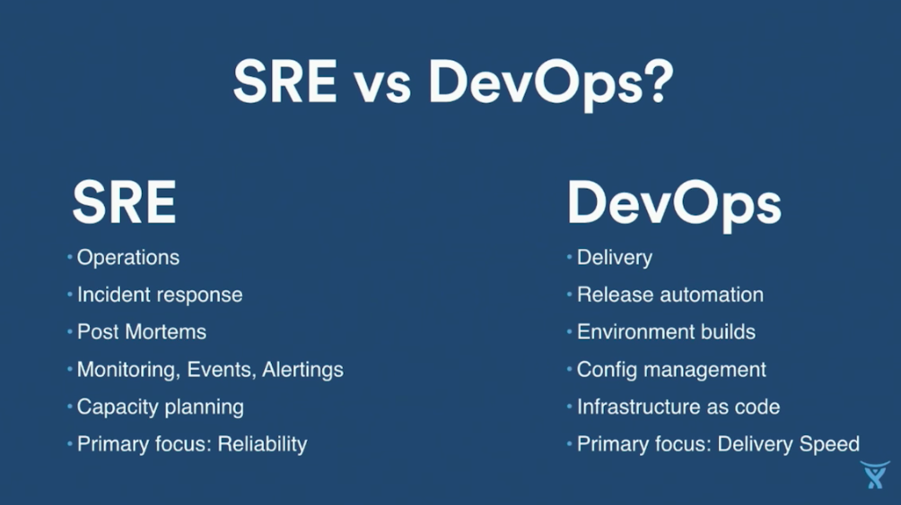
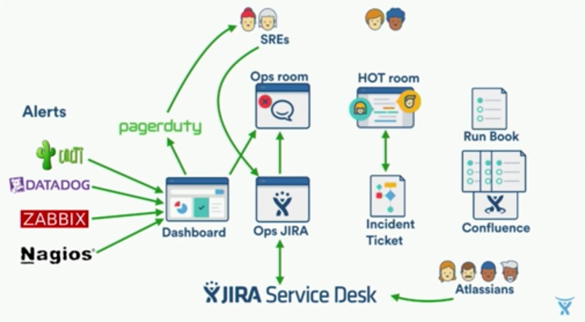

# Love DevOps? Wait until you meet SRE - Atlassian
[链接](https://www.youtube.com/watch?v=fsTpRx8Pt-k)

### Setting the scene
- too much change
- works in dev, now ops problem
- too much firefighting
- fixing the same thing repeatedly

### SRE and how it can help

SRE vs DevOps:

TIPs:
- Balance: Interrupt vs Preventative work
- Hire Devs
- Always do Post-Mortems
- Scrap the release meeting  

### Getting started
The journey to SRE:
- Vision: Define how the team will work and how we measure success
- Build: Get the team up and running
- Improve: Revisit regularly - if its not working, tweak, change, refine.

Vision:
- Responsibilities:
  - Service list
  - Service Owners
  - Team Duties
- Goals and Metrics:
  - Replace monitoring
  - DR Plan and Test
  - Number of Incidents
  - PIR Coverage
- Team Structure:

Build:
- Hiring:
  - Start Early
  - Promotion Opportunities
  - Existing hiring pipeline
- Training:
  - Bootcamps
  - Wheel of Misfortune
- Tools:
  - Set things so they can work

Improve:
- Review decisions
- Change where needed
- Blog success stories  

### Ops Toolchain

#### Incident: 
